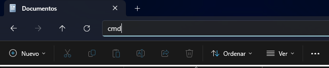

# MrxHex

## Descripción del Proyecto

En este apartado encontrarán el back enfocado hacia el area textil de ropa femenina, en el cual se maneja fichas técnicas para manejar el paso a paso de cada prenda de vestir que debe manejar un proceso riguroso, el usuario podrá encontrar todos los datos necesario para ver diseños pasados y seguir una ruta marcada de ideas nuevas o revivir nuevas modas, esto es con fin de tener un centro de datos principalmente donde almacenar y perdurar lo valioso que son los datos como los diseños, el paso a paso, el tipo de tela, hilo y manera en que se debe confeccionar las prendas.

---

## Requisitos mínimos para la instalación del desarrollo

Antes de empezar, asegúrate de contar con:

-   **Sistema operativo**: Windows 10+ / macOS 10.15+ / Linux (Ubuntu 18.04+)
-   **Lenguaje y entorno de ejecución**:
    -   Node.js ≥ 23.7
    -   npm ≥ 10.9.2 (o yarn ≥ 1.x)
-   **Base de datos** (si aplica):
    -   MySQL ≥ 8.0.42
-   **Herramientas adicionales**:
    -   Git ≥ 2.47.1
-   **Espacio en disco**: ≥ 60 MB libres
-   **Memoria RAM**: ≥ 4 GB
-   **Navegador**:
    -   Chrome ≥ 135.0.7049.96

---

## Tecnologías usadas

-   **Node.js**
-   **Express**
-   **MySQL2**
-   **JWT (jsonwebtoken)**
-   **Bcrypt**
-   **CORS**
-   **Dotenv**
-   **Jest** y **Supertest** para pruebas
-   **Nodemon** para desarrollo

## Paso a paso de la instalación

Sigue estos pasos para poner en marcha el entorno de desarrollo:

## Scripts disponibles

-   `npm run dev`  
    Ejecuta el servidor en modo desarrollo con Nodemon.

-   `npm run test`  
    Ejecuta las pruebas con Jest.

1. **Clonar el repositorio**
    - Inicialmente dirigete a la carpeta donde deseas almacenar el repositorio que te agregará la carpeta **Proyecto-Sena-Back**, da **Click derecho** -> **Terminal** o en la barra del explorador de archivos le escribes **cmd** y **enter**, esto te abrirá el cmd
      
    - En el CMD escribe los siguientes comandos:
    ```bash
    git clone https://github.com/Catmorx/Proyecto-Sena-Back.git
    cd Proyecto-Sena-Back
    ```
2. **Instalar Paquetes**
    ```bash
      npm i
    ```
3. **Crear archivo .env**
    ```bash
      cp .env.example .env
    ```
4. **Configurar el .env**
      ```
      # Server settings
      SERVER_PORT=4000
      PORT=3306
      FRONT_URL=http://localhost:3000
      # Database settings
      DATABASE = nombre_de_tu_base_de_datos
      DB_USER = tu_usuario
      DB_PASSWORD = tu_password
      JWT_SECRET=tu_clave_ultra_secreta
      ```
5. **Ejecutar Script MySql**

    - Se debe ejecutar la base de datos adjunta en la carpera *database*, para poder almcenar información con el back

6. **Ejecutar el Servidor**
    ```
    npm run dev
    ```
7. **LICENSE**
   - This project is licensed under the ISC License.